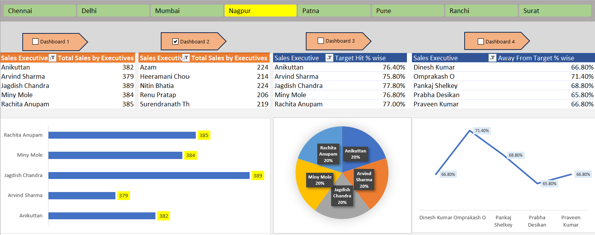
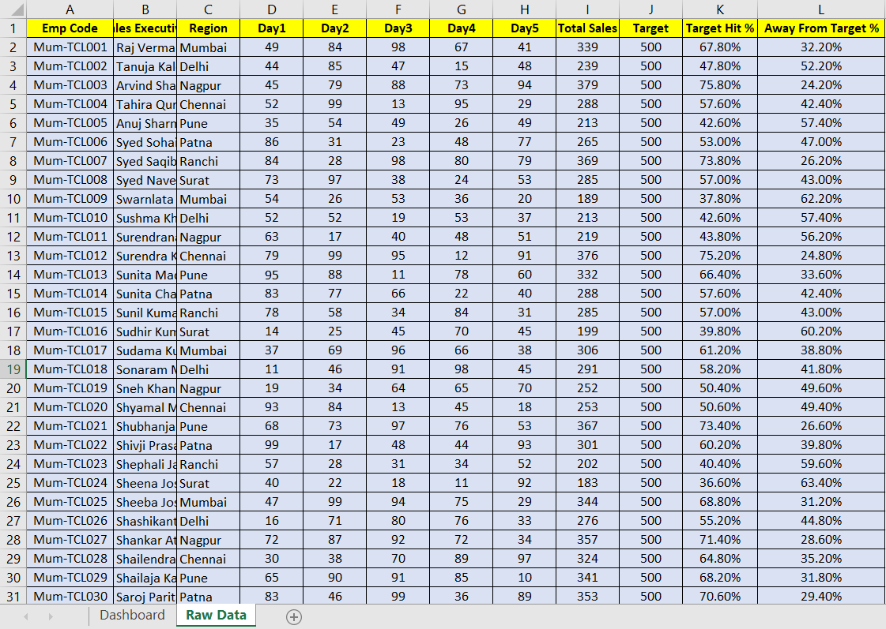

# 📊 Sales Dashboard in Excel

## Project Overview

This project is an interactive Sales Dashboard created in Microsoft Excel to analyze sales performance across different cities and sales executives.

The dashboard provides a quick overview of:

- Total Sales by Sales Executives
- Target Hit Percentage Analysis
- Away From Target Percentage Analysis
- City-wise Filtering using Slicers
- Interactive Charts and Visualizations

---

## Dashboard Preview

---

## Features

### 1. City-wise Filtering

Users can filter the dashboard using city buttons such as:

- Chennai
- Delhi
- Mumbai
- Nagpur
- Patna
- Pune
- Ranchi
- Surat

This allows dynamic analysis of sales performance across different locations.

---

### 2. Total Sales Analysis

Displays total sales achieved by each sales executive.

Visualized using:

- Pivot Tables
- Horizontal Bar Charts

---

### 3. Target Hit Percentage

Shows the percentage of sales targets achieved by sales executives.

Visualized using:

- Pivot Tables
- Pie Chart

---

### 4. Away From Target Percentage

Displays how far each executive is from their assigned targets.

Visualized using:

- Pivot Tables
- Line Chart

---

## Tools & Technologies

- Microsoft Excel
- Pivot Tables
- Pivot Charts
- Slicers
- Data Visualization
- Dashboard Design

---

## Dataset

The dashboard is built using sales transaction data containing:

- City Information
- Sales Executive Names
- Sales Values
- Target Achievement Metrics

---

## Raw Data Sheet

The workbook also contains a Raw Data sheet used as the source for Pivot Tables and Dashboard calculations.

---

## Key Skills Demonstrated

- Data Cleaning
- Data Analysis
- Dashboard Development
- KPI Tracking
- Business Reporting
- Data Visualization
- Excel Automation Concepts

---

## How to Use

1. Download the Excel workbook.
2. Open `Sales_Dashboard.xlsx`.
3. Enable editing if prompted.
4. Use the city slicers to filter dashboard data.
5. Interact with charts and tables for analysis.

---

## Project Outcome

This dashboard helps stakeholders:

- Monitor sales performance
- Track target achievement
- Identify underperforming executives
- Compare city-wise performance
- Make data-driven business decisions

---

## Author

Lakshita Bhardwaj

Aspiring Data Analyst | Excel | SQL | Python | Power BI
